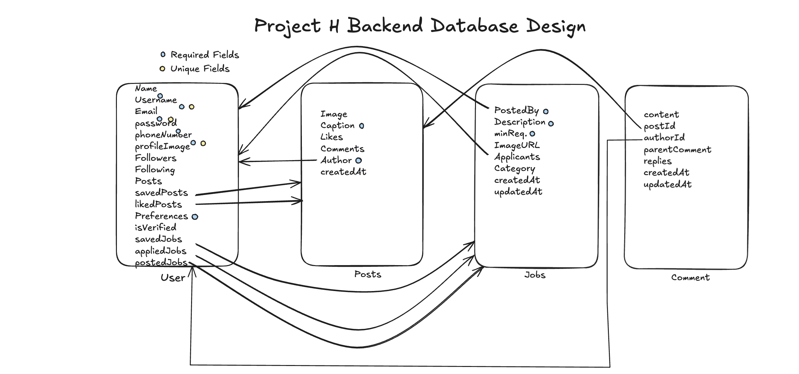

# Project H Backend

## Prerequisites

Before running this project, ensure you have the following installed:

- **Node.js** (v14+)
- **MongoDB** (locally or via a service like MongoDB Atlas)

---

## Getting Started

Follow these steps to set up the project:

### 1. Clone the Repository

Clone the repository to your local machine:

```bash
git clone https://github.com/SHIVAM-KUMAR-59/Project-H-Backend.git
```

### 2. Install Dependencies

Navigate into the project directory and install all required dependencies:

```bash
npm install
```

### 3. Run the Application

Start the application using the following command:

```bash
node index.js
```

## Tasks

### 1. Create Schemas

- [x] Design and implement Mongoose schema for **User**:
  - [x] `name`
  - [x] `username`
  - [x] `email`
  - [x] `password`
  - [x] `phoneNumber`
  - [x] `profileImage`
  - [x] `followers`
  - [x] `following`
  - [x] `posts`
  - [x] `savedPosts`
  - [x] `likedPosts`
  - [x] `preferences`
  - [x] `isVerified`
  - [x] `savedJobs`
  - [x] `appliedJobs`
  - [x] `oauthProvider`
  - [x] `oauthProviderId`
- [ ] Design and implement Mongoose schema for **Post**:
  - [ ] `image`
  - [ ] `caption`
  - [ ] `likes`
  - [ ] `comments`
  - [ ] `author`
  - [ ] `createdAt`
- [ ] Design and implement Mongoose schema for **Job**:
  - [ ] `postedBy`
  - [ ] `description`
  - [ ] `minReq`
  - [ ] `imageURL`
  - [ ] `applicants`
  - [ ] `status`
  - [ ] `createdAt`
  - [ ] `updatedAt`
- [x] Design and implement Mongoose schema for **Comment**:
  - [x] `content`
  - [x] `authorId`
  - [x] `postId`
  - [x] `parentComment`
  - [x] `replies`
  - [x] `createdAt`
  - [x] `updatedAt`

---

### 2. Create Routes

#### User Routes

- [ ] `POST /auth/register` - Register a new user.
- [ ] `POST /auth/login` - Authenticate and log in a user.
- [ ] `GET /users/:id` - Get user details by ID.
- [ ] `PUT /users/:id` - Update user profile.
- [ ] `DELETE /users/:id` - Delete a user.
- [ ] `POST /users/:id/follow` - Follow another user.
- [ ] `POST /users/:id/unfollow` - Unfollow a user.
- [ ] `GET /users/:id/followers` - Get a user's followers list.
- [ ] `GET /users/:id/following` - Get a user's following list.

#### Post Routes

- [ ] `POST /posts` - Create a new post.
- [ ] `GET /posts` - Get all posts.
- [ ] `GET /posts/:id` - Get a post by ID.
- [ ] `PUT /posts/:id` - Update a post.
- [ ] `DELETE /posts/:id` - Delete a post.
- [ ] `POST /posts/:id/like` - Like a post.
- [ ] `POST /posts/:id/unlike` - Unlike a post.
- [ ] `POST /posts/:id/comment` - Add a comment to a post.
- [ ] `GET /posts/:id/comments` - Get all comments for a post.

#### Job Routes

- [ ] `POST /jobs` - Create a new job posting.
- [ ] `GET /jobs` - Get all job postings.
- [ ] `GET /jobs/:id` - Get a job by ID.
- [ ] `PUT /jobs/:id` - Update a job posting.
- [ ] `DELETE /jobs/:id` - Delete a job posting.
- [ ] `POST /jobs/:id/apply` - Apply for a job.
- [ ] `GET /jobs/:id/applicants` - Get a list of applicants for a job.

---

### 3. Test Routes

- [ ] Test all the routes using **Postman** or similar API testing tools.

---

## Connection String

- **Drivers**: mongodb+srv://shivamkumardev01:<db_password>@cluster0.jlqeh.mongodb.net/?retryWrites=true&w=majority&appName=Cluster0
- **Compass**: mongodb+srv://shivamkumardev01:<db_password>@cluster0.jlqeh.mongodb.net/
- **Shell**: mongosh "mongodb+srv://cluster0.jlqeh.mongodb.net/" --apiVersion 1 --username shivamkumardev01
- **VS Code**: mongodb+srv://shivamkumardev01:<db_password>@cluster0.jlqeh.mongodb.net/
- **db_password**: xQgmrdgq0Hsxx6Mu

---

## Schema Diagram:

</img>
