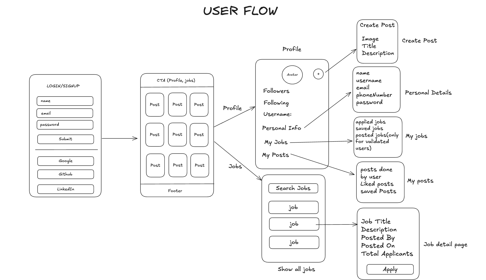

# Project H Backend

## Prerequisites

Before running this project, ensure you have the following installed:

- **Node.js** (v14+)
- **MongoDB** (locally or via a service like MongoDB Atlas)

---

## Getting Started

Follow these steps to set up the project:

### 1. Clone the Repository

Clone the repository to your local machine:

```bash
git clone https://github.com/SHIVAM-KUMAR-59/Project-H-Backend.git
```

### 2. Install Dependencies

Navigate into the project directory and install all required dependencies:

```bash
npm install
```

### 3. Run the Application

Start the application using the following command:

```bash
node index.js
```

## Tasks

### ✅ 1. Create Schemas

- [x] Design and implement Mongoose schema for **User**:

- [x] Design and implement Mongoose schema for **Post**:

- [x] Design and implement Mongoose schema for **Job**:

- [x] Design and implement Mongoose schema for **Comment**:

---

### 2. ✅ Create Routes

### ✅ Auth Routes

- [x] `POST /auth/register` - Register a new user.
- [x] `POST /auth/login` - Authenticate and log in a user.
- [x] `POST /auth/verify-otp` - Otp Verification.
- [x] `POST /auth/resent-otp` - Resent Otp
- [x] `POST /auth/forgot-password` - Forgot Password
- [x] `POST /auth/reset-password` - Reset Password
- [x] `POST /auth/google` - Google OAuth
- [x] `POST /auth/github` - Github OAuth

#### ✅ User Routes

- [x] `GET /users/:id` - Get user details by ID.
- [x] `PATCH /users/:id` - Update user profile.
- [x] `DELETE /users/:id` - Delete a user.
- [x] `POST /users/:id/follow-unfollow` - Follow or Unfollow a user.
- [x] `GET /users/:id/followers` - Get a user's followers list.
- [x] `GET /users/:id/following` - Get a user's following list.

#### ✅ Post Routes

- [x] `POST /posts` - Create a new post.
- [x] `GET /posts` - Get all posts.
- [x] `GET /posts/:id` - Get a post by ID.
- [x] `PATCH /posts/:id` - Update a post.
- [x] `DELETE /posts/:id` - Delete a post.
- [x] `POST /posts/:id/like-unlike` - Like or Unlike a post.
- [x] `POST /posts/:id/comment` - Add a comment to a post.
- [x] `GET /posts/:id/comments` - Get all comments for a post.

#### ✅ Job Routes

- [x] `POST /jobs` - Create a new job posting.
- [x] `GET /jobs` - Get all job postings.
- [x] `GET /jobs/:id` - Get a job by ID.
- [x] `PATCH /jobs/:id` - Update a job posting.
- [x] `DELETE /jobs/:id` - Delete a job posting.
- [x] `POST /jobs/:id/apply` - Apply for a job.
- [x] `GET /jobs/:id/applicants` - Get a list of applicants for a job.

#### ✅ Comment Routes

- [x] `GET /comments/:id` - Get a comment by ID.
- [x] `PATCH /comments/:id` - Update a comment.
- [x] `DELETE /comments/:id` - Delete a comment.
- [x] `POST /comments/:id/reply` - Reply to a comment.
- [x] `GET /comments/:id/replies` - Get all replies for a comment.

---

### 3. Test Routes

- [ ] Test all the routes using **Postman** or similar API testing tools.

---

## Schema Diagram:

</img>

## User Flow:

</img>


---


## NGROK server Set Up

- Create an account on [Ngrok](https://ngrok.com/) if you don't have one.
- Follow the **ngrok** installation guide to install it on your local system.
- Once installed, run the following command in your terminal to start a tunnel for your local server:
```bash
ngrok http 5002(PORT)  // Used **PORT** according to you run your project on which PORT

```
- This will give you a public URL like (e.g., https://fawn-two-nominally.ngrok-free.app) that can be used to send webhook payloads to your local server.


## Set Up Clerk Webhook
- Log in to your **Clerk Dashboard**.
- Navigate to the **Configre** page -> **Webhooks** page.
- click **Add Endpoint**.
- In the Endpoint URL field, paste the URL from **Ngrok,** followed by **/api/webhooks** like (e.g., https://146f-106-219-121-105.ngrok-free.app/api/webhooks).
- Under Subscribe to events, select `user.created`, `user.updated` and `user.deleted` (or other events as needed).
- Copy the Signing Secret and save it to your **.env.local** file, like this:
```
SIGNING_SECRET=whsec_1234567890abcdef

```
### Add Clerk Credential in .env file 

```
CLERK_PUBLISHABLE_KEY= your_publishable_key
CLERK_SECRET_KEY= your_api_key
CLERK_WEBHOOK_SECRET= your_webhook_singing_key

```

### Install Required Packages

Install the necessary dependencies:

```bash

npm install @clerk/express svix

```
## Package Details
- **1. @clerk/express** – Clerk SDK to interact with the Clerk API.
- **2. svix** – Used for **webhook** signature verification.


